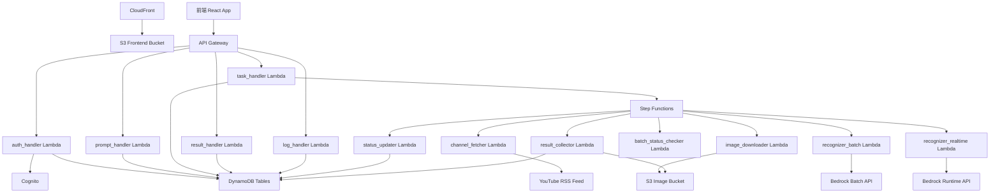
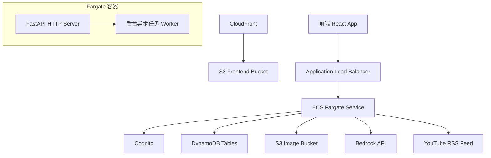
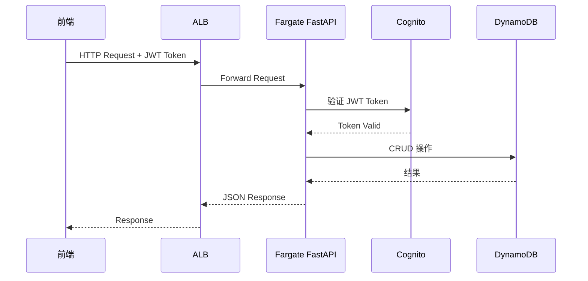
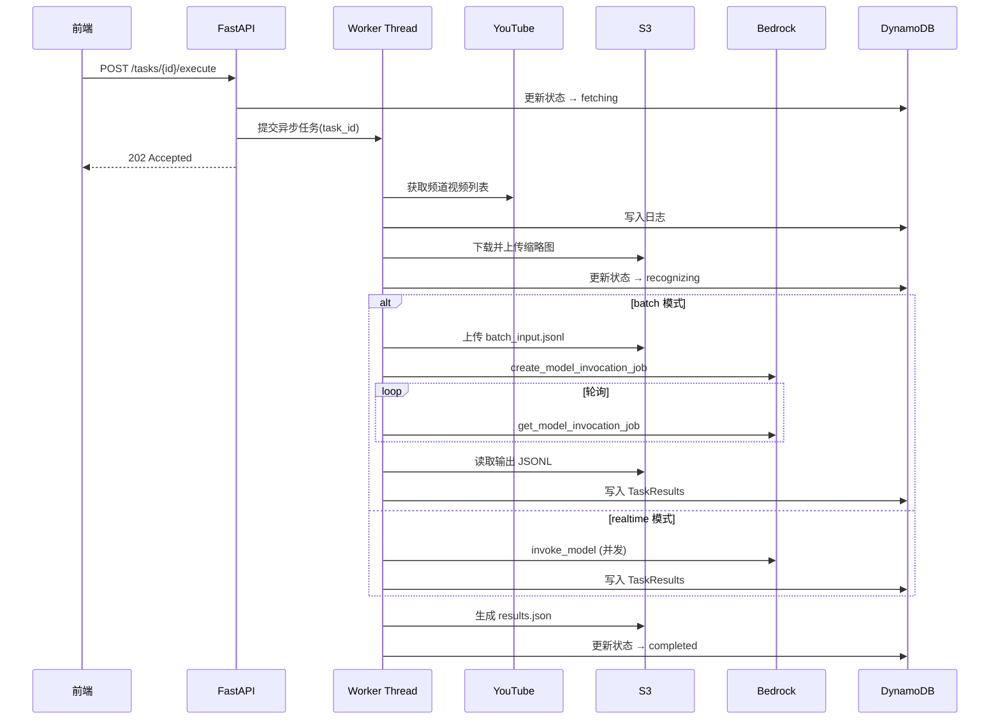

# Design Document: ECS Fargate Migration

## Overview

将现有的 Step Functions + Lambda 后端架构迁移到 ECS Fargate 统一服务架构。当前系统包含 5 个 API Lambda handler（auth、prompt、task、result、log）和 7 个工作流 Lambda handler（channel_fetcher、image_downloader、recognizer_batch、recognizer_realtime、batch_status_checker、result_collector、status_updater），由 Step Functions 状态机编排工作流。迁移后，所有功能合并为一个 ECS Fargate 服务，API 层使用 FastAPI 框架提供 HTTP 接口，工作流部分改为后台异步任务在 Fargate 服务内通过线程池处理。

迁移范围：
- 移除所有 12 个 Lambda 函数
- 移除 Step Functions 状态机（InfraStack 中的占位 + AppStack 中的实际定义）
- 新增 ECS Fargate 服务（VPC、ECS Cluster、Task Definition、Service、ALB）
- API Gateway 改为指向 ALB（或直接用 ALB 替代 API Gateway）
- 工作流编排从 Step Functions 改为 Fargate 服务内的后台异步任务

## Architecture

### 迁移前架构



### 迁移后架构



## Sequence Diagrams

### API 请求流程



### 工作流执行流程（异步任务）



## Components and Interfaces

### Component 1: FastAPI HTTP Server

**用途**: 替代原有 5 个 API Lambda + API Gateway，提供统一的 REST API 服务

**接口**:
```python
# backend/app/main.py — FastAPI 应用入口
from fastapi import FastAPI

app = FastAPI(title="Image Review API")

# 路由注册
app.include_router(auth_router, prefix="/auth")
app.include_router(prompt_router, prefix="/prompts")
app.include_router(task_router, prefix="/tasks")
```

**路由映射**（与现有 API Gateway 路由完全一致）:
- `POST /auth/login` → 无需认证
- `POST /auth/change-password` → 需要认证
- `POST /prompts` / `GET /prompts` / `GET /prompts/{id}` / `PUT /prompts/{id}` / `DELETE /prompts/{id}`
- `POST /tasks` / `GET /tasks` / `GET /tasks/{id}` / `POST /tasks/{id}/execute` / `POST /tasks/{id}/retry`
- `GET /tasks/{id}/logs`
- `GET /tasks/{id}/results` / `GET /tasks/{id}/results/download`

**职责**:
- 接收 HTTP 请求并路由到对应处理函数
- JWT Token 验证（通过 Cognito JWKS）
- 请求参数验证
- 调用 DynamoDB CRUD 操作
- 触发后台异步任务（execute/retry）

### Component 2: 后台异步任务 Worker

**用途**: 替代原有 Step Functions + 7 个工作流 Lambda，在 Fargate 服务内执行长时间运行的工作流

**接口**:
```python
# backend/app/worker.py — 异步任务管理
import asyncio
from concurrent.futures import ThreadPoolExecutor

class TaskWorker:
    """后台任务执行器，管理工作流的异步执行。"""
    
    def __init__(self, max_workers: int = 3):
        self.executor = ThreadPoolExecutor(max_workers=max_workers)
        self.running_tasks: dict[str, asyncio.Task] = {}
    
    async def submit_execute(self, task_id: str, payload: dict) -> None:
        """提交执行任务（完整工作流）。"""
        ...
    
    async def submit_retry(self, task_id: str, payload: dict) -> None:
        """提交重做任务（跳过频道获取和图片下载）。"""
        ...
    
    async def get_status(self, task_id: str) -> str:
        """查询后台任务运行状态。"""
        ...
```

**职责**:
- 管理后台任务的生命周期
- 执行完整工作流：频道获取 → 图片下载 → 推理 → 结果收集 → 状态更新
- 执行重做工作流：推理 → 结果收集 → 状态更新
- 错误处理和状态回写（失败时更新为 failed）
- 批量推理模式下的轮询等待

### Component 3: Cognito JWT 验证中间件

**用途**: 替代 API Gateway 的 Cognito Authorizer

**接口**:
```python
# backend/app/auth.py — JWT 验证
from fastapi import Depends, HTTPException
from fastapi.security import HTTPBearer

security = HTTPBearer()

async def verify_token(credentials = Depends(security)) -> dict:
    """验证 Cognito JWT Token，返回用户信息。"""
    ...
```

**职责**:
- 从 Cognito JWKS 端点获取公钥
- 验证 JWT Token 签名和过期时间
- 提取用户身份信息

## Data Models

数据模型不变，继续使用现有 DynamoDB 表结构：

### Tasks 表
```python
# 与现有结构完全一致
task_item = {
    "task_id": str,          # PK
    "name": str,
    "description": str,
    "channel_ids": list[str],
    "template_id": str,
    "run_mode": str,          # "batch" | "realtime"
    "status": str,            # "pending" | "fetching" | "recognizing" | "completed" | "failed" | "partial_completed"
    "total_images": int,
    "success_count": int,
    "failure_count": int,
    "sfn_execution_arn": str, # 迁移后此字段废弃，改为 worker_task_id
    "created_by": str,
    "created_at": str,
    "updated_at": str,
}
```

**变更**: `sfn_execution_arn` 字段不再使用，可保留兼容或新增 `worker_task_id` 字段标识后台任务。

### 其他表（无变更）
- Users、PromptTemplates、PromptTemplateHistory、TaskResults、TaskLogs — 结构和用法完全不变

## Key Functions with Formal Specifications

### Function 1: run_workflow()

```python
async def run_workflow(task_id: str, payload: dict) -> None:
    """执行完整工作流：频道获取 → 图片下载 → 推理 → 结果收集 → 状态更新。"""
```

**Preconditions:**
- `task_id` 对应的任务存在且状态为 `fetching`
- `payload` 包含 `channel_ids`, `template_id`, `run_mode`, `system_prompt`, `user_prompt`

**Postconditions:**
- 成功时：任务状态更新为 `completed`，TaskResults 表写入所有结果，results.json 上传到 S3
- 失败时：任务状态更新为 `failed`，错误信息写入 TaskLogs
- 部分成功时：任务状态更新为 `partial_completed`

### Function 2: run_retry_workflow()

```python
async def run_retry_workflow(task_id: str, payload: dict) -> None:
    """执行重做工作流：跳过频道获取和图片下载，直接进入推理阶段。"""
```

**Preconditions:**
- `task_id` 对应的任务存在
- `payload` 包含 `failed_images`, `run_mode`, `system_prompt`, `user_prompt`
- `failed_images` 非空

**Postconditions:**
- 与 `run_workflow` 相同的结果保证

### Function 3: poll_batch_job()

```python
async def poll_batch_job(task_id: str, batch_job_arn: str, interval: int = 60) -> str:
    """轮询 Bedrock 批量推理任务状态，直到完成或失败。"""
```

**Preconditions:**
- `batch_job_arn` 是有效的 Bedrock 批量任务 ARN

**Postconditions:**
- 返回 `"Completed"` 或 `"Failed"`
- 每次轮询写入 TaskLogs


## Algorithmic Pseudocode

### 工作流执行算法

```python
async def run_workflow(task_id: str, payload: dict) -> None:
    """完整工作流执行算法。"""
    try:
        # Step 1: 频道获取
        channel_ids = payload["channel_ids"]
        all_videos = []
        for ch_id in channel_ids:
            try:
                xml_text = fetch_feed(ch_id)
                videos = parse_feed(xml_text, ch_id)
                all_videos.extend(videos)
                write_task_log(task_id, "channel_fetch", ch_id, "success", f"获取到 {len(videos)} 个视频")
            except Exception as e:
                write_task_log(task_id, "channel_fetch", ch_id, "failed", str(e))
        
        if not all_videos:
            raise RuntimeError("所有频道获取失败")

        # Step 2: 图片下载
        downloaded = []
        for video in all_videos:
            try:
                image_data = download_image(video["thumbnail_url"])
                s3_key = f"tasks/{task_id}/input/{video['video_id']}.jpg"
                upload_file(s3_key, image_data)
                downloaded.append({**video, "s3_key": s3_key, "image_name": f"{video['video_id']}.jpg"})
            except Exception as e:
                write_task_log(task_id, "image_download", video["video_id"], "failed", str(e))

        # Step 3: 更新状态 → recognizing
        update_task_status(task_id, "recognizing")

        # Step 4: 推理
        run_mode = payload["run_mode"]
        if run_mode == "batch":
            stats = await run_batch_inference(task_id, downloaded, payload)
        else:
            stats = await run_realtime_inference(task_id, downloaded, payload)

        # Step 5: 生成 results.json
        generate_results_json(task_id)

        # Step 6: 更新最终状态
        if stats["failed"] > 0 and stats["success"] > 0:
            update_task_status(task_id, "partial_completed", stats)
        elif stats["failed"] > 0:
            update_task_status(task_id, "failed", stats)
        else:
            update_task_status(task_id, "completed", stats)

    except Exception as e:
        update_task_status(task_id, "failed")
        write_task_log(task_id, "workflow", task_id, "failed", str(e))
```

### 批量推理 + 轮询算法

```python
async def run_batch_inference(task_id: str, images: list, payload: dict) -> dict:
    """批量推理：构建 JSONL → 提交任务 → 轮询等待 → 收集结果。"""
    # 构建并上传 JSONL
    jsonl_content = build_jsonl(images, task_id, payload["system_prompt"], payload["user_prompt"])
    jsonl_key = f"tasks/{task_id}/input/batch_input.jsonl"
    upload_file(jsonl_key, jsonl_content)

    # 提交 Bedrock 批量任务
    batch_job_arn = create_batch_job(task_id, jsonl_key)

    # 轮询等待完成
    status = await poll_batch_job(task_id, batch_job_arn, interval=60)
    if status == "Failed":
        raise RuntimeError(f"批量推理任务失败: {batch_job_arn}")

    # 收集结果
    return collect_batch_results(task_id, images)


async def poll_batch_job(task_id: str, batch_job_arn: str, interval: int = 60) -> str:
    """轮询 Bedrock 批量任务状态。"""
    while True:
        status = get_batch_job_status(batch_job_arn)
        write_task_log(task_id, "model_invoke", batch_job_arn, "success", f"状态: {status}")
        
        if status == "Completed":
            return "Completed"
        elif status == "Failed":
            return "Failed"
        
        await asyncio.sleep(interval)
```

## Example Usage

### Dockerfile

```dockerfile
FROM python:3.12-slim

WORKDIR /app

COPY requirements.txt .
RUN pip install --no-cache-dir -r requirements.txt

COPY backend/ ./backend/

EXPOSE 8000

CMD ["uvicorn", "backend.app.main:app", "--host", "0.0.0.0", "--port", "8000"]
```

### FastAPI 路由示例

```python
# backend/app/routers/tasks.py
from fastapi import APIRouter, Depends
from backend.app.auth import verify_token
from backend.app.worker import task_worker

router = APIRouter()

@router.post("/{task_id}/execute", status_code=202)
async def execute_task(task_id: str, user: dict = Depends(verify_token)):
    """触发任务执行 — 提交到后台 Worker。"""
    task = get_task(task_id)
    if task["status"] not in ("pending", "failed", "partial_completed"):
        raise HTTPException(400, f"当前状态 '{task['status']}' 不允许执行")
    
    template = get_template(task["template_id"])
    payload = {
        "task_id": task_id,
        "channel_ids": task["channel_ids"],
        "template_id": task["template_id"],
        "run_mode": task["run_mode"],
        "system_prompt": template["system_prompt"],
        "user_prompt": template["user_prompt"],
    }
    
    update_task_status(task_id, "fetching")
    await task_worker.submit_execute(task_id, payload)
    
    return {"data": {"task_id": task_id}, "message": "任务已提交执行"}
```

### CDK ECS Fargate 定义示例

```python
# cdk/app_stack.py — 核心变更
from aws_cdk import (
    aws_ecs as ecs,
    aws_ecs_patterns as ecs_patterns,
    aws_ec2 as ec2,
    aws_ecr_assets as ecr_assets,
)

# VPC
vpc = ec2.Vpc(self, "AppVpc", max_azs=2, nat_gateways=1)

# ECS Cluster
cluster = ecs.Cluster(self, "AppCluster", vpc=vpc)

# Docker Image
image = ecr_assets.DockerImageAsset(self, "BackendImage", directory="../backend")

# ALB + Fargate Service
fargate_service = ecs_patterns.ApplicationLoadBalancedFargateService(
    self, "BackendService",
    cluster=cluster,
    cpu=512,
    memory_limit_mib=1024,
    desired_count=1,
    task_image_options=ecs_patterns.ApplicationLoadBalancedTaskImageOptions(
        image=ecs.ContainerImage.from_docker_image_asset(image),
        container_port=8000,
        environment=common_env,
    ),
    public_load_balancer=True,
)
```

## Correctness Properties

*A property is a characteristic or behavior that should hold true across all valid executions of a system-essentially, a formal statement about what the system should do. Properties serve as the bridge between human-readable specifications and machine-verifiable correctness guarantees.*

### Property 1: API 响应格式兼容性

*For any* 有效的 API 请求，FastAPI_Server 返回的 JSON 响应体结构（字段名、嵌套层级、数据类型）应与现有 Lambda handler 返回的响应体结构完全一致。

**Validates: Requirements 1.2, 1.4**

### Property 2: JWT 验证 round-trip

*For any* 由 Cognito 签发的有效 JWT Token，JWT_Middleware 验证通过后提取的用户身份信息（username、sub）应与 Token payload 中编码的信息完全一致；对于任意无效或过期的 Token，JWT_Middleware 应返回 HTTP 401。

**Validates: Requirements 2.1, 2.2, 2.3**

### Property 3: 异步端点立即响应

*For any* 任务执行请求（execute 或 retry），FastAPI_Server 应在工作流开始执行前返回 HTTP 202 响应，响应时间不依赖于工作流的执行时长。

**Validates: Requirements 3.1, 5.1**

### Property 4: 工作流状态机正确性

*For any* 工作流执行（包括完整执行和重做），任务状态应严格按照以下转换规则更新：fetching → recognizing → completed/partial_completed/failed。全部成功时终态为 completed，部分失败时为 partial_completed，未捕获异常时为 failed。

**Validates: Requirements 4.1, 4.2, 4.3, 4.4, 4.5, 5.3**

### Property 5: 工作流执行完整性

*For any* 完整工作流执行，TaskLogs 表中应包含按时间顺序排列的频道获取、图片下载、推理、结果收集步骤的日志记录；对于重做工作流，日志中不应包含频道获取和图片下载步骤。

**Validates: Requirements 3.2, 3.3, 5.2**

### Property 6: 工作流并发控制

*For any* 数量的并发工作流提交，同时运行的工作流数量不应超过配置的最大并发数（默认 3）。

**Validates: Requirement 3.4**

### Property 7: 错误容忍性

*For any* 图片列表，即使其中部分图片推理失败，Task_Worker 仍应继续处理其余图片，失败的图片应记录错误日志而不中断整个工作流。

**Validates: Requirements 7.4, 6.5**

### Property 8: JSONL 构建正确性

*For any* 有效的图片列表和 prompt 配置，Task_Worker 构建的 JSONL 文件中每条记录应包含正确的 S3 图片路径、system_prompt 和 user_prompt，且记录数等于图片数。

**Validates: Requirement 6.1**

### Property 9: 推理结果查询一致性

*For any* 已完成的任务，GET /tasks/{id}/results 返回的结果集合应与 TaskResults 表中该任务的所有记录一致，且 results.json 文件应包含所有结果。

**Validates: Requirements 7.3, 8.1, 8.2**

### Property 10: 数据写入格式兼容性

*For any* 推理结果，Task_Worker 写入 TaskResults 表的数据格式（字段名、数据类型、值范围）应与现有 Lambda handler 写入的格式完全一致。

**Validates: Requirement 12.3**

### Property 11: 实时推理并发控制

*For any* 数量的待处理图片，实时推理模式下同时调用 Bedrock API 的请求数不应超过 Semaphore 配置的限制值。

**Validates: Requirement 7.2**

### Property 12: 批量推理轮询日志

*For any* 批量推理任务，轮询期间每次状态检查的结果应写入 TaskLogs 表，轮询间隔应符合配置值。

**Validates: Requirement 6.3**

## Error Handling

### 工作流执行失败

**条件**: 工作流任何步骤抛出未捕获异常
**响应**: 捕获异常，更新任务状态为 `failed`，写入错误日志到 TaskLogs
**恢复**: 用户可通过 `POST /tasks/{id}/execute` 重新执行，或 `POST /tasks/{id}/retry` 重做失败项

### 单个频道/图片失败

**条件**: 单个频道获取或单张图片下载失败
**响应**: 记录日志，跳过失败项，继续处理其余项（与现有行为一致）
**恢复**: 工作流继续执行，最终状态可能为 `partial_completed`

### Fargate 容器崩溃

**条件**: 容器进程异常退出
**响应**: ECS 自动重启容器（通过 desired_count 和健康检查）
**恢复**: 正在执行的后台任务会丢失，需要用户手动重新触发。任务状态可能停留在中间状态（fetching/recognizing），需要前端支持重新执行

### Bedrock 批量任务超时

**条件**: 批量推理任务长时间未完成
**响应**: 轮询设置最大等待时间（如 24 小时），超时后标记为 failed
**恢复**: 用户可重新执行或切换为 realtime 模式

## Performance Considerations

- **Fargate 资源配置**: 初始 512 CPU / 1024 MB 内存，可根据并发任务数调整
- **后台任务并发**: ThreadPoolExecutor 限制最大并发工作流数（默认 3），避免资源耗尽
- **实时推理并发**: 保持现有 asyncio.Semaphore 并发控制（默认 5）
- **批量轮询间隔**: 60 秒，与现有 Step Functions Wait 状态一致
- **ALB 健康检查**: 配置 `/health` 端点，确保容器就绪后才接收流量
- **冷启动**: Fargate 容器启动时间约 30-60 秒，比 Lambda 冷启动略长，但服务持续运行后无冷启动问题

## Security Considerations

- **VPC 隔离**: Fargate 服务运行在私有子网，通过 NAT Gateway 访问外部服务
- **IAM Task Role**: ECS Task Role 需要与现有 Lambda 角色相同的权限（DynamoDB、S3、Bedrock、Cognito）
- **ALB 安全组**: 仅开放 80/443 端口
- **JWT 验证**: 从 API Gateway Cognito Authorizer 迁移到应用层 JWT 验证，使用 Cognito JWKS 公钥
- **环境变量**: 敏感配置通过 ECS Task Definition 的 secrets 从 SSM Parameter Store 或 Secrets Manager 注入
- **CORS**: 在 FastAPI 中间件中配置，替代 API Gateway 的 CORS 配置

## Dependencies

### 新增依赖
- `fastapi` — Web 框架
- `uvicorn` — ASGI 服务器
- `python-jose[cryptography]` — JWT Token 验证
- `httpx` — 异步 HTTP 客户端（获取 Cognito JWKS）

### 保留依赖
- `boto3` — AWS SDK（DynamoDB、S3、Bedrock、Cognito）
- 现有 `backend/shared/` 工具层完全复用

### CDK 新增依赖
- `aws-cdk-lib/aws_ecs` — ECS 服务
- `aws-cdk-lib/aws_ec2` — VPC
- `aws-cdk-lib/aws_ecs_patterns` — ALB + Fargate 快捷构造
- `aws-cdk-lib/aws_ecr_assets` — Docker 镜像构建

### 移除依赖
- `aws-cdk-lib/aws_lambda` — Lambda 函数
- `aws-cdk-lib/aws_stepfunctions` — Step Functions
- `aws-cdk-lib/aws_stepfunctions_tasks` — Step Functions Lambda 任务
