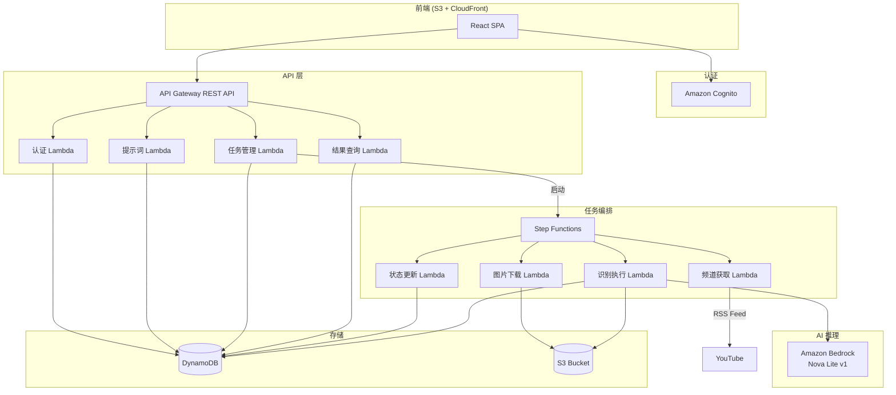
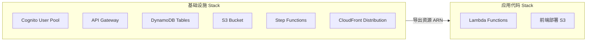
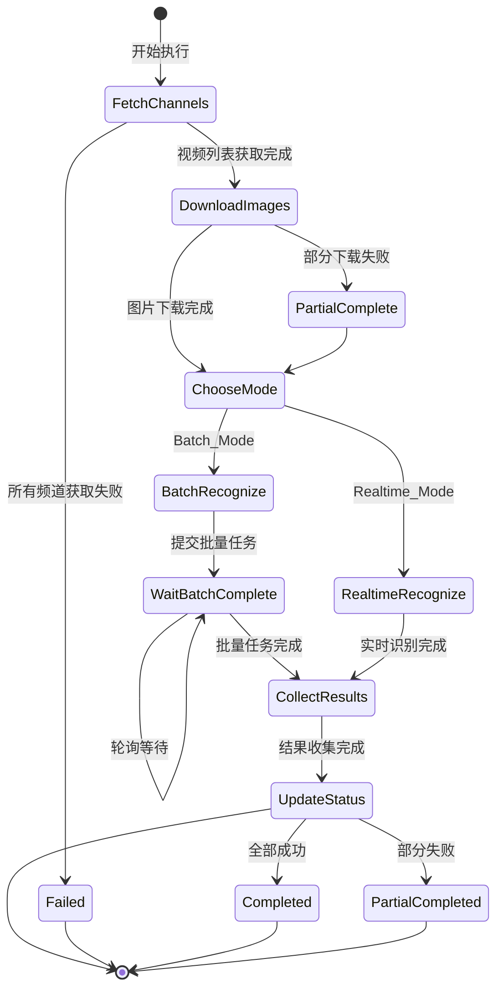
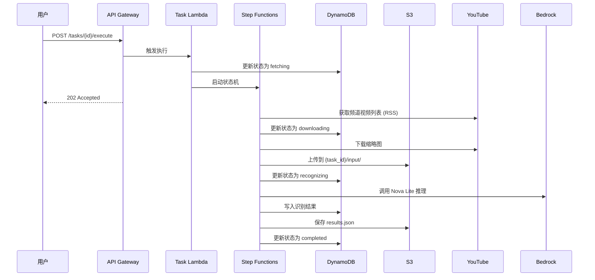

# 技术设计文档：图片批量识别与审核平台

## 概述

本设计将现有的 YouTube 缩略图儿童内容检测脚本重构为一个完整的无服务器（Serverless）Web 平台。平台采用前后端分离架构，后端基于 AWS Lambda + API Gateway + DynamoDB + S3 构建，前端使用 React SPA 托管在 S3 + CloudFront 上。用户通过 Amazon Cognito 进行认证，任务通过 Step Functions 编排异步执行。

基础设施使用 AWS CDK (Python) 定义，代码和基础设施分离为独立的部署单元，支持独立版本管理和部署流水线。

### 设计目标

- 全无服务器架构，按需付费，零运维
- 代码与基础设施分离部署（独立 CDK Stack）
- 异步任务执行，支持批量和实时两种推理模式
- 可扩展的提示词模板系统
- 完整的任务生命周期管理（创建→执行→结果→重做）

### 技术选型

| 组件 | 技术 |
|------|------|
| 认证 | Amazon Cognito User Pool |
| API | API Gateway REST API + Lambda (Python 3.12) |
| 数据库 | DynamoDB |
| 存储 | S3 (nova-test-image) |
| 任务编排 | AWS Step Functions |
| AI 推理 | Amazon Bedrock (Nova Lite v1) |
| 前端 | React + Vite，托管于 S3 + CloudFront |
| IaC | AWS CDK (Python) |
| 区域 | ap-northeast-1 |

## 架构

### 系统架构图



### 部署架构

代码和基础设施分为两个独立的 CDK Stack，支持独立部署：



- **InfraStack**：管理所有 AWS 基础设施资源（DynamoDB 表、S3 桶、Cognito、API Gateway、Step Functions、CloudFront）
- **AppStack**：管理 Lambda 函数代码和前端静态资源部署，引用 InfraStack 导出的资源 ARN


## 组件与接口

### Lambda 函数清单

| Lambda 函数 | 职责 | 触发方式 |
|-------------|------|----------|
| `auth_handler` | 用户认证（登录、修改密码） | API Gateway |
| `prompt_handler` | 提示词模板 CRUD | API Gateway |
| `task_handler` | 任务创建、列表、详情、执行触发、重做 | API Gateway |
| `result_handler` | 结果查询、过滤、下载链接生成 | API Gateway |
| `log_handler` | 任务日志查询 | API Gateway |
| `channel_fetcher` | 通过 RSS Feed 获取频道视频列表 | Step Functions |
| `image_downloader` | 下载缩略图并上传到 S3 | Step Functions |
| `recognizer_batch` | 构建并提交 Bedrock 批量推理任务 | Step Functions |
| `recognizer_realtime` | 并发调用 Bedrock 实时推理 API（使用 asyncio + 可配置并发数） | Step Functions |
| `batch_status_checker` | 轮询批量推理任务状态 | Step Functions |
| `result_collector` | 收集推理结果并写入 DynamoDB | Step Functions |
| `status_updater` | 更新任务状态和进度 | Step Functions |

### REST API 端点设计

所有 API 通过 API Gateway 暴露，除登录接口外均需 Cognito JWT 认证。

#### 认证 API

| 方法 | 路径 | 描述 | 请求体 |
|------|------|------|--------|
| POST | `/auth/login` | 用户登录 | `{username, password}` |
| POST | `/auth/change-password` | 修改密码 | `{old_password, new_password}` |

#### 提示词模板 API

| 方法 | 路径 | 描述 |
|------|------|------|
| POST | `/prompts` | 创建模板 |
| GET | `/prompts` | 获取模板列表 |
| GET | `/prompts/{id}` | 获取模板详情 |
| PUT | `/prompts/{id}` | 更新模板 |
| DELETE | `/prompts/{id}` | 删除模板 |

#### 任务 API

| 方法 | 路径 | 描述 |
|------|------|------|
| POST | `/tasks` | 创建任务 |
| GET | `/tasks` | 获取任务列表 |
| GET | `/tasks/{id}` | 获取任务详情 |
| POST | `/tasks/{id}/execute` | 执行任务 |
| POST | `/tasks/{id}/retry` | 重做失败图片 |
| GET | `/tasks/{id}/logs` | 获取任务日志 |

#### 结果 API

| 方法 | 路径 | 描述 |
|------|------|------|
| GET | `/tasks/{id}/results` | 获取识别结果（支持分页和过滤） |
| GET | `/tasks/{id}/results/download` | 获取结果文件下载链接 |


### 任务执行流程（Step Functions）



### 重做流程

重做仅针对失败图片重新执行识别阶段：

1. API 接收重做请求，从 DynamoDB 查询该任务下状态为"失败"的结果记录
2. 启动 Step Functions，跳过频道获取和图片下载阶段
3. 仅对失败图片执行识别
4. 更新结果记录和任务进度统计
5. 重新生成 S3 结果 JSON 文件


## 数据模型

### DynamoDB 表设计

#### 1. Users 表

用于存储用户凭据信息（作为 Cognito 的补充，存储平台级用户元数据）。

| 属性 | 类型 | 说明 |
|------|------|------|
| `user_id` (PK) | String | 用户 ID（对应 Cognito sub） |
| `username` | String | 用户名 |
| `display_name` | String | 显示名称 |
| `created_at` | String | 创建时间 (ISO 8601) |
| `updated_at` | String | 更新时间 (ISO 8601) |

> 认证主要由 Cognito 处理，此表仅存储平台级元数据。

#### 2. PromptTemplates 表

| 属性 | 类型 | 说明 |
|------|------|------|
| `template_id` (PK) | String | 模板 ID (UUID) |
| `name` | String | 模板名称 |
| `description` | String | 模板描述 |
| `system_prompt` | String | 系统提示词（定义模型角色和行为） |
| `user_prompt` | String | 用户提示词（定义具体分析指令） |
| `version` | Number | 版本号（每次编辑递增） |
| `created_by` | String | 创建者 user_id |
| `created_at` | String | 创建时间 (ISO 8601) |
| `updated_at` | String | 更新时间 (ISO 8601) |

> 提示词分为系统提示词和用户提示词两部分。系统提示词定义模型的角色（如"你是一个图片内容审核专家"），用户提示词定义具体分析指令（如"分析这张图片是否包含暴力内容"）。推理时两者分别放入 Bedrock API 的 `system` 和 `messages[].content` 字段，并启用 Prompt Caching 以降低延迟和成本。

GSI: `NameIndex` — PK: `name`，用于按名称查询。

#### 3. PromptTemplateHistory 表

| 属性 | 类型 | 说明 |
|------|------|------|
| `template_id` (PK) | String | 模板 ID |
| `version` (SK) | Number | 版本号 |
| `system_prompt` | String | 该版本的系统提示词 |
| `user_prompt` | String | 该版本的用户提示词 |
| `updated_by` | String | 修改者 user_id |
| `updated_at` | String | 修改时间 (ISO 8601) |


#### 4. Tasks 表

| 属性 | 类型 | 说明 |
|------|------|------|
| `task_id` (PK) | String | 任务 ID (UUID) |
| `name` | String | 任务名称 |
| `description` | String | 任务描述 |
| `channel_ids` | List[String] | YouTube 频道 ID 列表 |
| `template_id` | String | 关联的提示词模板 ID |
| `run_mode` | String | 运行模式：`batch` 或 `realtime` |
| `status` | String | 任务状态（见状态枚举） |
| `total_images` | Number | 总图片数 |
| `success_count` | Number | 成功数 |
| `failure_count` | Number | 失败数 |
| `sfn_execution_arn` | String | Step Functions 执行 ARN |
| `created_by` | String | 创建者 user_id |
| `created_at` | String | 创建时间 (ISO 8601) |
| `updated_at` | String | 更新时间 (ISO 8601) |

任务状态枚举：`pending`（待执行）、`fetching`（获取封面中）、`downloading`（下载图片中）、`recognizing`（识别中）、`completed`（已完成）、`failed`（失败）、`partial_completed`（部分完成）

GSI: `StatusIndex` — PK: `status`, SK: `created_at`，用于按状态过滤任务列表。

#### 5. TaskResults 表

结果结构泛化设计：不硬编码特定审核类型（如儿童检测），而是将模型返回的完整 JSON 存储在 `result_json` 中，由提示词模板决定识别什么、输出什么。仅提取一个通用的 `review_result` 字段（`pass` / `fail`）作为最终审核结论。

| 属性 | 类型 | 说明 |
|------|------|------|
| `task_id` (PK) | String | 任务 ID |
| `image_name` (SK) | String | 图片文件名 |
| `video_id` | String | YouTube 视频 ID |
| `channel_id` | String | YouTube 频道 ID |
| `channel_name` | String | 频道名称 |
| `s3_key` | String | 图片 S3 路径 |
| `status` | String | 识别状态：`success` / `failed` |
| `result_json` | Map | 模型返回的完整识别结果 JSON（内容由提示词模板决定） |
| `review_result` | String | 最终审核结论：`pass`（通过）/ `fail`（不通过） |
| `error_message` | String | 失败时的错误信息 |
| `created_at` | String | 创建时间 (ISO 8601) |
| `updated_at` | String | 更新时间 (ISO 8601) |

> `result_json` 的具体字段由提示词模板决定，可能包含儿童检测、暴力检测、色情检测等任意审核维度。`review_result` 是从 `result_json` 中提取的统一审核结论，提示词模板中应要求模型在输出 JSON 中包含 `review_result` 字段。

GSI: `TaskStatusIndex` — PK: `task_id`, SK: `status`，用于按状态过滤结果（如查询失败图片用于重做）。
GSI: `TaskReviewIndex` — PK: `task_id`, SK: `review_result`，用于按审核结论过滤结果。


#### 6. TaskLogs 表

| 属性 | 类型 | 说明 |
|------|------|------|
| `task_id` (PK) | String | 任务 ID |
| `timestamp` (SK) | String | 日志时间戳 (ISO 8601) |
| `operation_type` | String | 操作类型：`channel_fetch` / `image_download` / `model_invoke` / `status_update` |
| `target` | String | 操作对象（频道 ID、图片名等） |
| `result` | String | 操作结果：`success` / `failed` |
| `message` | String | 详细信息 |

### S3 存储结构

```
s3://nova-test-image/
├── tasks/
│   └── {task_id}/
│       ├── input/                    # 下载的缩略图 + 批量推理输入
│       │   ├── {video_id}.jpg
│       │   └── batch_input.jsonl     # 批量推理 JSONL（仅 Batch_Mode）
│       └── output/                   # 推理结果
│           └── results.json
```

> 批量推理的 `batch_input.jsonl` 与图片放在同一个 `input/` 目录下，便于 Bedrock 批量推理任务直接引用同目录的图片 S3 URI。

### 关键数据流




## 正确性属性

*属性是一种在系统所有有效执行中都应成立的特征或行为——本质上是关于系统应该做什么的形式化陈述。属性是人类可读规范与机器可验证正确性保证之间的桥梁。*

### Property 1: 提示词模板创建 round-trip

*For any* 有效的模板名称和内容，创建模板后通过返回的模板 ID 查询，应能获取到相同的名称和内容。

**Validates: Requirements 2.1**

### Property 2: 提示词模板列表完整性

*For any* 已创建的模板集合，查询模板列表返回的结果数量应等于已创建的模板数量，且每条结果包含 name、description 和 created_at 字段。

**Validates: Requirements 2.2**

### Property 3: 提示词模板编辑保留历史

*For any* 已存在的模板，编辑内容后，当前模板应反映新内容，且 PromptTemplateHistory 表中应存在包含旧内容的历史记录，版本号递增。

**Validates: Requirements 2.3**

### Property 4: 未引用模板可删除

*For any* 未被任何任务引用的模板，删除操作应成功，且之后查询该模板应返回 not found。

**Validates: Requirements 2.4**

### Property 5: 被引用模板删除保护

*For any* 被至少一个任务引用的模板，删除操作应被拒绝，且响应中包含关联的任务信息。

**Validates: Requirements 2.5**


### Property 6: 任务创建 round-trip（含多频道）

*For any* 有效的任务配置（包含 1 到 N 个频道 ID、模板 ID、运行模式），创建任务后通过任务 ID 查询，应能获取到相同的配置信息，状态为 `pending`，且所有频道 ID 完整保留。

**Validates: Requirements 3.1, 3.2, 3.5**

### Property 7: 频道 URL 解析

*For any* 有效的 YouTube 频道 URL（格式如 `https://www.youtube.com/channel/{id}` 或 `https://www.youtube.com/@{handle}`），系统应正确解析出频道 ID。

**Validates: Requirements 3.3**

### Property 8: 运行模式验证

*For any* 非 `batch` 且非 `realtime` 的运行模式值，任务创建应被拒绝并返回参数错误。

**Validates: Requirements 3.4**

### Property 9: 任务列表字段完整性

*For any* 已创建的任务集合，查询任务列表返回的每条记录应包含 name、status、created_at 和 updated_at 字段。

**Validates: Requirements 4.1**

### Property 10: 状态变更更新时间戳

*For any* 任务状态变更操作，变更后 DynamoDB 中该任务的 status 应为新状态，且 updated_at 应晚于变更前的值。

**Validates: Requirements 4.3**

### Property 11: 任务详情包含进度统计

*For any* 任务，查询详情应返回 total_images、success_count、failure_count，且 success_count + failure_count <= total_images。

**Validates: Requirements 4.4**

### Property 12: RSS Feed 解析完整性

*For any* 有效的 YouTube RSS Feed XML 响应，解析后的每个视频记录应包含非空的 thumbnail_url、video_id、channel_id 和 channel_name。

**Validates: Requirements 5.2**


### Property 13: 频道获取容错

*For any* 包含多个频道 ID 的列表，如果其中部分频道获取失败，成功获取的频道结果不应受影响，且失败频道应产生错误日志。

**Validates: Requirements 5.3**

### Property 14: S3 路径格式不变量

*For any* 任务 ID 和图片文件名，上传的图片 S3 路径应匹配 `tasks/{task_id}/input/{image_name}` 格式，批量推理 JSONL 路径应匹配 `tasks/{task_id}/input/batch_input.jsonl` 格式，结果文件路径应匹配 `tasks/{task_id}/output/results.json` 格式。

**Validates: Requirements 5.4, 11.1, 11.2**

### Property 15: 批量推理 JSONL 构建正确性

*For any* 图片列表和提示词模板（system_prompt + user_prompt），生成的 JSONL 中每条记录应包含有效的 recordId、正确的 S3 图片 URI、与模板 system_prompt 一致的 system 字段、与模板 user_prompt 一致的 user message 文本，且 system 消息上应包含 `cachePoint` 标记以启用 Prompt Caching。batch_input.jsonl 文件应与图片位于同一 `input/` 目录下。

**Validates: Requirements 6.1, 6.3**

### Property 16: 识别结果存储完整性

*For any* 识别结果（成功或失败），保存到 DynamoDB 后查询应能获取到相同的数据，且 status 字段为 `success` 或 `failed` 之一。成功记录应包含 result_json 和 review_result（`pass` 或 `fail`），失败记录应包含非空的 error_message。

**Validates: Requirements 6.4, 6.5, 9.3**

### Property 17: 认证令牌校验

*For any* 受保护的 API 端点（登录接口除外），不携带有效认证令牌的请求应返回 401 状态码。

**Validates: Requirements 1.4, 12.2**

### Property 18: 认证错误信息不泄露

*For any* 无效的用户名或密码组合，登录 API 返回的错误信息不应包含"用户名不存在"、"密码错误"等具体失败原因。

**Validates: Requirements 1.2**


### Property 19: 日志完整性与排序

*For any* 任务的日志记录集合，每条日志应包含 timestamp、operation_type、target 和 result 字段，且查询返回的日志列表应按 timestamp 升序排列。

**Validates: Requirements 8.1, 8.2, 8.3**

### Property 20: 结果分页正确性

*For any* 包含 N 条结果的任务和页大小 P，分页查询应返回 min(P, 剩余数量) 条结果，且遍历所有页后的结果总数应等于 N。

**Validates: Requirements 9.1**

### Property 21: 结果过滤准确性

*For any* 过滤条件（review_result、status 以及 result_json 中的自定义字段）和结果集，返回的每条结果都应满足所有指定的过滤条件。

**Validates: Requirements 9.2**

### Property 22: 结果 JSON 文件与 DynamoDB 一致性

*For any* 已完成的任务，S3 上的 results.json 文件内容应与 DynamoDB TaskResults 表中该任务的所有成功记录一致。

**Validates: Requirements 9.4**

### Property 23: 重做保持成功结果不变量

*For any* 包含成功和失败结果的已完成任务，执行重做后，所有原先成功的结果记录应保持不变（内容和时间戳均不变），仅失败记录被重新处理。

**Validates: Requirements 10.1, 10.2**

### Property 24: 重做后进度统计一致性

*For any* 重做完成的任务，success_count + failure_count 应等于 total_images，且 S3 结果 JSON 文件应反映最新的成功结果。

**Validates: Requirements 10.3**

### Property 25: 可重复重做

*For any* 重做后仍包含失败结果的任务，再次调用重做 API 应被接受（不返回错误）。

**Validates: Requirements 10.4**

### Property 26: API 参数验证

*For any* API 端点和不合法的请求参数（缺少必填字段、类型错误、值超出范围），应返回 400 状态码且响应体包含具体的参数错误描述。

**Validates: Requirements 12.3**

### Property 27: 内部错误信息不泄露

*For any* 导致 500 错误的 API 请求，响应体不应包含堆栈跟踪、文件路径、数据库表名等内部实现细节。

**Validates: Requirements 12.4**

### Property 28: 实时推理并发控制

*For any* 实时推理任务和配置的并发数 C，同一时刻正在执行的 Bedrock 推理调用数不应超过 C。

**Validates: Requirements 7.4**

### Property 29: Prompt Cache 标记正确性

*For any* 推理请求（实时或批量），system 消息应包含 `cachePoint` 标记，且 system_prompt 和 user_prompt 内容应与关联的 Prompt_Template 一致。

**Validates: Requirements 6.3**


## 错误处理

### API 层错误处理

所有 Lambda 函数统一使用错误处理装饰器，确保：

1. **参数验证错误** → 400 Bad Request，响应体包含字段级错误描述
2. **认证/授权错误** → 401 Unauthorized（由 API Gateway Cognito Authorizer 处理）
3. **资源不存在** → 404 Not Found，响应体包含资源类型和 ID
4. **业务逻辑冲突** → 409 Conflict（如删除被引用的模板）
5. **内部错误** → 500 Internal Server Error，返回通用错误信息，不暴露内部细节

统一错误响应格式：

```json
{
  "error": {
    "code": "VALIDATION_ERROR",
    "message": "请求参数不合法",
    "details": [
      {"field": "name", "message": "名称不能为空"}
    ]
  }
}
```

### 任务执行错误处理

Step Functions 状态机内置错误处理：

1. **频道获取失败**：单个频道失败不影响其他频道，记录错误日志，继续处理。全部频道失败则任务状态设为 `failed`。
2. **图片下载失败**：单张图片下载失败跳过该图片，记录错误日志。下载阶段结束后统计成功/失败数。
3. **模型调用失败**：
   - Realtime_Mode：单张失败标记为 `failed`，记录 error_message，继续处理其余图片
   - Batch_Mode：批量任务失败则整体重试一次，仍失败则标记所有未完成图片为 `failed`
4. **Lambda 超时**：Step Functions 捕获超时错误，更新任务状态为 `failed`，记录超时日志
5. **DynamoDB 写入失败**：使用指数退避重试（最多 3 次），仍失败则记录错误并继续

### 重试策略

| 操作 | 重试次数 | 退避策略 |
|------|----------|----------|
| YouTube RSS 获取 | 3 | 指数退避，初始 1s |
| 图片下载 | 2 | 固定 2s 间隔 |
| Bedrock 实时推理 | 3 | 指数退避，初始 2s |
| DynamoDB 写入 | 3 | 指数退避，初始 0.5s |
| Bedrock 批量任务提交 | 1 | 固定 30s 间隔 |


## 测试策略

### 双重测试方法

本项目采用单元测试与属性测试相结合的方式，确保全面覆盖：

- **单元测试**：验证具体示例、边界情况和错误条件
- **属性测试**：验证跨所有输入的通用属性

两者互补：单元测试捕获具体 bug，属性测试验证通用正确性。

### 属性测试配置

- **测试库**：[Hypothesis](https://hypothesis.readthedocs.io/)（Python 属性测试库）
- **每个属性测试最少运行 100 次迭代**
- **每个属性测试必须通过注释引用设计文档中的属性编号**
- **标签格式**：`Feature: image-review-platform, Property {number}: {property_text}`
- **每个正确性属性由一个属性测试实现**

### 单元测试范围

单元测试聚焦于：

- 具体示例（如：有效登录返回 token、修改密码成功）
- 集成点（如：Lambda 与 DynamoDB 交互、S3 预签名 URL 生成）
- 边界情况（如：空频道列表、超长模板内容、并发重做请求）
- 错误条件（如：过期 token、不存在的任务 ID、无效 JSON 输入）

### 属性测试范围

属性测试覆盖设计文档中定义的 27 个正确性属性，重点包括：

- Round-trip 属性（Property 1, 6, 16）：创建→查询一致性
- 不变量属性（Property 10, 11, 14, 23, 24）：状态变更、进度统计、路径格式
- 过滤/排序属性（Property 19, 20, 21）：日志排序、分页、结果过滤
- 安全属性（Property 17, 18, 26, 27）：认证校验、信息不泄露
- 业务规则属性（Property 4, 5, 8, 13, 15, 25）：删除保护、模式验证、容错

### 测试分层

| 层级 | 工具 | 覆盖范围 |
|------|------|----------|
| 单元测试 | pytest | Lambda handler 逻辑、工具函数、数据验证 |
| 属性测试 | pytest + hypothesis | 正确性属性（27 个） |
| 集成测试 | pytest + moto | Lambda 与 AWS 服务交互（DynamoDB、S3） |
| E2E 测试 | pytest | 部署后 API 端到端验证 |

### 模拟策略

- 使用 [moto](https://github.com/getmoto/moto) 模拟 AWS 服务（DynamoDB、S3、Cognito）
- 使用 `unittest.mock` 模拟外部依赖（YouTube RSS Feed、Bedrock API）
- 属性测试中使用 Hypothesis 的 `@given` 装饰器生成随机输入

